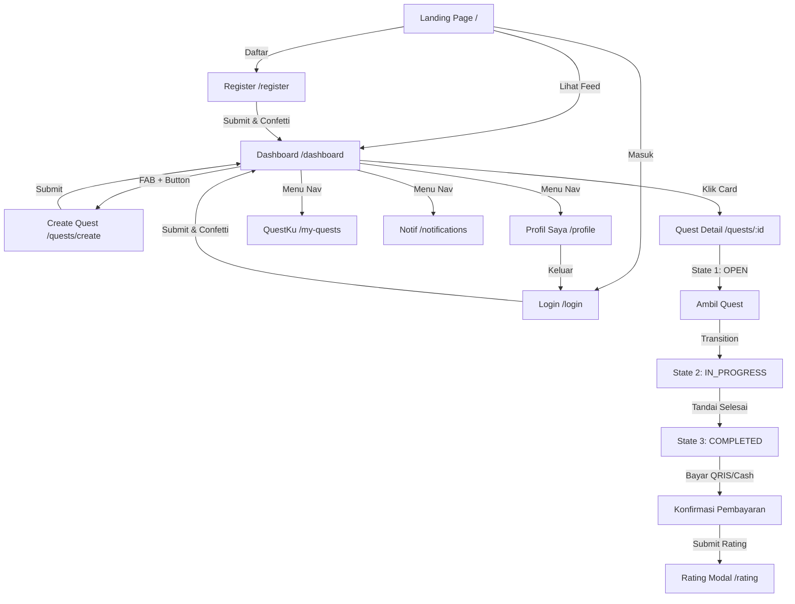

# Project Analysis: YUKgas.in Frontend

Dokumen ini berisi analisis mendalam terhadap source code dan struktur project frontend **YUKgas.in** (marketplace micro-task khusus kampus UNU). Analisis ini bertujuan untuk mempermudah transisi pengerjaan backend dan integrasi database (PostgreSQL + Prisma ORM) tanpa merusak desain atau interaksi yang telah dibuat.

---

## 1. Teknologi yang Digunakan (Tech Stack)

### Frontend (Client-Side)
*   **HTML5 & Semantic Elements**: Struktur halaman web yang mobile-first dengan pembatasan area konten menggunakan wrapper `max-w-md mx-auto` untuk menirukan aplikasi mobile.
*   **Tailwind CSS (via Play CDN)**: Styling menggunakan `https://cdn.tailwindcss.com` yang dimuat secara dinamis pada `<head>` setiap halaman. Konfigurasi warna kustom (seperti `sunset`, `golden`, `teal`, `coral`, `cream`, `espresso`, dan `mocha`) dideklarasikan secara inline di masing-masing file HTML.
*   **Lucide Icons (via CDN)**: Menggunakan icon library Lucide (`https://cdn.jsdelivr.net/npm/lucide@0.460.0/dist/umd/lucide.min.js`) dengan inisialisasi dinamis melalui `lucide.createIcons()`.
*   **Vanilla JavaScript (Global Interaction Helper)**:
    *   File utama: [/frontend/public/assets/app.js](file:///C:/KULIAH/semester%204/rekayasa%20web/projectUAS/yukgas/frontend/public/assets/app.js)
    *   Objek global `YG` mengelola:
        *   `YG.toast()`: Sistem notifikasi melayang (Success, Error, Info, Warning).
        *   `YG.pop()`: Animasi popup bulat loading & centang sukses (satisfying feedback).
        *   `YG.confetti()`: Efek burst partikel warna-warni saat aksi sukses.
        *   `YG.navigate()`: Navigasi antar-halaman yang halus dengan transisi exit/enter.
        *   `YG.ripple()`: Efek riak air (ripple click) pada button/link.
        *   `YG.haptic()`: Feedback getaran perangkat (vibration API).
*   **Custom Vanilla CSS**:
    *   File utama: [/frontend/public/assets/style.css](file:///C:/KULIAH/semester%204/rekayasa%20web/projectUAS/yukgas/frontend/public/assets/style.css)
    *   Mendefinisikan variabel CSS (`:root`), setup animasi (fade-in, stagger reveal, shimmer skeleton, float, dll.), serta class utilitas kustom seperti `.warm-card`, `.btn-sunset`, `.warm-input`, `.price-badge`, dan status badge.

### Konfigurasi Routing & Server
*   **Vercel Routing (`vercel.json`)**:
    *   Mendefinisikan rewrites dari clean URLs (seperti `/register`, `/quests/create`, `/quests/:id`, `/profile`) ke static file HTML di dalam folder `public/`.
    *   Mengatur header keamanan (`X-Content-Type-Options`, `X-Frame-Options`, `Referrer-Policy`) serta cache immutable selama 1 tahun untuk asset di dalam `/assets`.

### Dependencies & Build Tools
*   **NPM / Package Manager**: Tidak ada (kosong).
*   File `package-lock.json` ada namun kosong (`"packages": {}`), dan tidak ada file `package.json` di root folder. Semua assets, script JS, dan CSS Tailwind di-load langsung via CDN.

---

## 2. Struktur Folder

Berikut adalah visualisasi struktur folder proyek saat ini:

```text
yukgas/
├── .git/                      # Version control database
├── .gitignore                 # Daftar file/folder yang diabaikan Git
└── frontend/                  # Folder terpadu untuk project frontend
    ├── PROJECT_ANALYSIS.md    # Dokumentasi analisis (file ini)
    ├── README.md              # Dokumentasi umum repositori
    ├── vercel.json            # Konfigurasi deploy & route rewrites Vercel
    ├── package.json           # File konfigurasi NPM & dev server local
    ├── server.js              # Server script lokal menggunakan Express
    ├── docs/                  # Dokumentasi requirements & rencana pengembangan
    │   ├── prd.md             # Product Requirements Document
    │   ├── srs.md             # Software Requirements Specification (Skema DB & API)
    │   ├── yukgas.md          # Laporan LENGKAP Proyek (Bab I - VI)
    │   ├── flow-testing.md    # Panduan verifikasi alur aplikasi (mockup mode)
    │   └── pages/             # Spesifikasi detail per halaman UI
    └── public/                # Folder root frontend (Vercel Output Directory)
        ├── index.html         # Landing Page utama
        ├── register.html      # Halaman Pendaftaran Akun
        ├── login.html         # Halaman Masuk Akun
        ├── dashboard.html     # Dashboard & Feed Quest utama
        ├── create-quest.html  # Halaman pembuatan/posting Quest
        ├── my-quests.html     # Tracker QuestKu (Diberikan & Diambil)
        ├── quest-detail.html  # Detail Quest (Mendukung state OPEN, PROGRESS, COMPLETED)
        ├── user-profile.html  # Profil publik pengguna lain (Giver/Taker)
        ├── my-profile.html    # Halaman edit profil & upload QRIS pribadi
        ├── notifications.html # List notifikasi aktivitas user
        ├── rating-modal.html  # Halaman review bintang dan ulasan
        └── assets/            # Aset global static
            ├── app.js         # Logic interaksi kustom & UI effects
            └── style.css      # Tema CSS "Warm Campus Vibe"
```

---

## 3. Fungsi Setiap Folder Penting

1.  **`/frontend/public`**
    Merupakan folder root dari aplikasi web di sisi client. Karena proyek saat ini menggunakan model static HTML tanpa compiler (seperti Webpack/Vite), folder ini di-serve secara utuh oleh server Vercel. Setiap file HTML di dalamnya mandiri dan merepresentasikan satu halaman atau view tertentu.
2.  **`/frontend/public/assets`**
    Berfungsi menyimpan CSS global (`style.css`) dan JavaScript helper (`app.js`). Kedua file ini dimuat oleh seluruh halaman HTML untuk memastikan keselarasan desain (Design System), animasi ripple, transisi halaman, dan popups.
3.  **`/frontend/docs`**
    Menyimpan seluruh spesifikasi teknis dan dokumentasi perencanaan. Folder ini sangat krusial bagi developer backend karena di dalamnya terdapat:
    *   **Skema Database Prisma** (`srs.md` - Bab 4.2) lengkap dengan model `User`, `Quest`, `Rating`, dan `QuestHistory`.
    *   **Spesifikasi REST API** (`srs.md` - Bab 5) dengan base URL `/api/v1` untuk meng-handle autentikasi JWT, CRUD Quest, status flow, dan rating.
4.  **`/frontend/docs/pages`**
    Berisi deskripsi fungsionalitas, copy text, handling state, dan skenario validasi dari masing-masing halaman HTML untuk mencocokkan UI mockup dengan ekspektasi backend.

---

## 4. Alur Aplikasi (Application Flow)

Aplikasi ini dirancang mobile-first dan memiliki 9 alur utama (detail langkah testing di `docs/flow-testing.md`):



1.  **Flow Autentikasi**: Landing (`/`) -> Register (`/register`) / Login (`/login`) -> Dashboard (`/dashboard`). Saat ini proses login/register masih disimulasikan secara lokal (Client-side delay 800ms) tanpa verifikasi database asli.
2.  **Flow Posting Quest**: Dashboard -> Pembuatan Quest (`/quests/create`). Form ini interaktif, memiliki penghitung karakter judul/deskripsi, live preview card secara real-time, dan memvalidasi minimal kompensasi Rp 1.000.
3.  **Flow Lifecycle Quest (Detail Halaman)**:
    Detail Quest (`/quests/:id`) diatur secara dinamis dalam satu file ([quest-detail.html](file:///C:/KULIAH/semester%204/rekayasa%20web/projectUAS/yukgas/frontend/public/quest-detail.html)) menggunakan toggling visibility berdasarkan URL Query Parameter `?state=`:
    *   **`?state=open` (Default)**: Menampilkan tombol **"Ambil Quest"** untuk taker.
    *   **`?state=progress`**: Menampilkan stepper aktif proses pengerjaan dan tombol **"Tandai Selesai"**.
    *   **`?state=completed`**: Menampilkan badge selesai, tombol **"Konfirmasi Pembayaran"** (membuka modal popup opsi QRIS / Cash), dan tombol untuk **"Beri Rating"** (`/rating`).
4.  **Flow Manajemen Profil**:
    *   **Edit Profil (`/profile`)**: Mengubah nama, bio (limit 200 karakter), dan upload QRIS.
    *   **Profil Publik (`/users/:id`)**: Viewport read-only untuk melihat track record transaksi dan review dari user lain.

---

## 5. Hal yang Perlu Diperhatikan Sebelum Menambah Fitur

Sebelum menambahkan backend atau memodifikasi frontend, Anda perlu mengantisipasi poin-poin berikut:

*   **SPA vs Multi-Page Static**: Karena halaman-halaman HTML bersifat mandiri (Multi-Page static), tidak ada *global state management* yang persistent (seperti React Context atau Redux) di memori browser. Jika berpindah halaman, seluruh variabel JavaScript akan di-reset dari awal.
*   **Migrasi ke React/Vite**: Di dalam laporan teknis (`yukgas.md` dan `srs.md`), tertulis bahwa tech stack frontend menggunakan **React.js + Tailwind CSS**. Namun, implementasi saat ini adalah **Plain HTML + CDN Tailwind**. Anda harus memutuskan:
    1.  *Pilihan A*: Melanjutkan dengan format Plain HTML saat ini (melakukan API fetch via standard JS `fetch()` / `axios` di dalam tag `<script>`).
    2.  *Pilihan B (Disarankan untuk masa depan)*: Melakukan migrasi/porting kode-kode HTML ini ke dalam component React/Next.js agar sesuai dengan Tech Stack awal yang direncanakan.
*   **Routing Lokal vs Production**: Routing clean URL (`/register`, `/dashboard`, dll.) hanya aktif saat dideploy ke Vercel (karena ditangani oleh rewrite engine Vercel). Saat dijalankan secara lokal (misalnya menggunakan `python -m http.server`), akses ke `/dashboard` akan menghasilkan error 404. Anda harus mengetikkan URL lengkap beserta ekstensinya (misalnya `localhost:8000/dashboard.html`).
*   **CDN Race Conditions**: Icon Lucide dimuat menggunakan script CDN secara asinkron. Terdapat fungsi retry `YG.initLucide()` untuk menangani delay loading CDN, pastikan fungsi ini dipanggil setiap kali ada komponen UI baru yang dirender secara dinamis.

---

## 6. Kemungkinan Masalah (Potential Issues & Technical Debt)

*   **Duplikasi Kode (High Technical Debt)**:
    Setiap file HTML menduplikat tag `<head>`, script Tailwind play CDN + konfigurasi warna, script Lucide icons, navigasi header, dan bottom navbar secara berulang-ulang. Jika ada perubahan minor pada navigasi, Anda harus mengubahnya di **11 file HTML berbeda**.
*   **FOUC (Flash of Unstyled Content)**:
    Karena CSS Tailwind dan icon dimuat dari CDN pihak ketiga setelah file HTML selesai diunduh browser, akan ada jeda waktu sekian milidetik di mana tampilan web terlihat rusak/polos (unstyled text) sebelum Tailwind dan Lucide selesai di-render.
*   **Autentikasi & Session Handling yang Lemah**:
    Saat ini, alur masuk dan daftar langsung mengarahkan ke dashboard tanpa menyimpan token JWT di `localStorage`, `sessionStorage`, ataupun `cookies`.
*   **Kehilangan Data Input**:
    Pada halaman Posting Quest dan Edit Profil, data form tidak dipertahankan. Jika halaman di-refresh, inputan pengguna langsung hilang karena tidak disimpan di *state store* browser.
*   **Skema Tipe Data dan Format**:
    Input kompensasi di frontend masih berwujud string/format Rupiah (misal: `Rp 5.000`), sedangkan skema basis data Prisma menggunakan tipe data `Decimal(10, 2)`. Anda perlu mengimplementasikan parser pembersih string (seperti `.replace(/\D/g, '')`) sebelum payload dikirimkan ke REST API backend.
